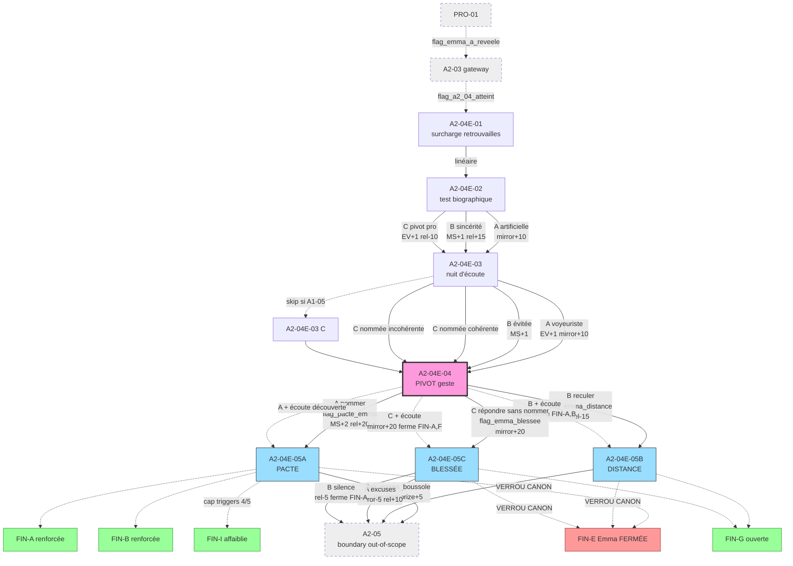

# Graph Audit — 2026-05-21
**Scope** : `A2-romance-emma` · **Export** : mermaid

## Bilan global

- **Arcs scannés** : `A2-romance-emma`
- **Nodes scannés** : 7 / 7 (tous avec table Transitions valide)
- **Branches** : 18 (toutes branches y compris variantes modificateurs et skip)
- **Fins déclarées** : 9 · **ouvertes par ≥ 1 branche dans ce scope** : 4 (FIN-A, FIN-B, FIN-G, FIN-I) · **fermées par ≥ 1 branche** : 4 (FIN-A, FIN-B, FIN-E, FIN-F) · **non touchées par cet arc** : FIN-C, FIN-D, FIN-H *(attendu — chaque arc touche un sous-ensemble)*
- **Anomalies** : **0 bloquantes** · **9 warnings** (toutes acquittables — voir détails)

---

## 🔴 Anomalies bloquantes

*Aucune.*

---

## 🟡 Warnings

### `EXTERNAL_DEP` — flags entrants posés hors scope (4)

Flags consommés au beat 1 mais posés par des nodes hors de l'arc audité :

| Flag attendu | Posé par | Statut |
|--------------|----------|--------|
| `flag_emma_a_reveele` | `PRO-01` *(existe, dans scope projet)* | ✅ OK |
| `flag_a2_04_atteint` | `A2-03` *(arc A2-principal, à spec — P1 todo)* | ⚠ acquittable — boundary attendue |
| `flag_a2_04e_eligible` | gateway `A2-04` *(arc A2-principal, à spec — P1 todo)* | ⚠ acquittable — boundary attendue |
| `flag_a1_05_passe` | `A1-05` *(history.md L259, à spec dans A1)* | ⚠ acquittable — fallback `false` documenté |

> Action : aucune action immédiate. À ré-auditer après `arc-spec A2-principal` (P1).

### `UNCONSUMED_FLAG` — flags posés sans consommateur in-scope (3)

Flags posés par des branches A2-04E mais non lus par d'autres branches A2-04E *(potentiels consommateurs en aval hors scope)* :

| Flag posé | Branche émettrice | Consommateur attendu |
|-----------|-------------------|----------------------|
| `flag_emma_intimite_artificielle` | `A2-04E-02 [A]` | A3-02 *(Emma sous pression — pourrait lire le mensonge initial)* — à valider |
| `flag_emma_intimite_instrumentalisee` | `A2-04E-02 [C]` | A2-05 *(confrontation Camille — pourrait colorer)* — à valider |
| `flag_emma_ecoute_evitee` | `A2-04E-03 [B]` | aucun consommateur identifié — *purement narratif, peut être supprimé si non utilisé* |
| `flag_emma_ecoute_nommee` | `A2-04E-03 [C]` | aucun consommateur identifié — idem |

> Action : passer en revue lors du `arc-spec A3` si ces flags ont vocation à être lus en aval. Sinon retirer du `node-spec` pour alléger.

### `DENSE_NODE` (1)

| Node | Branches sortantes | Justification |
|------|--------------------|-----------------|
| `A2-04E-04` (PIVOT) | **6** (3 base × 2 modificateurs `flag_emma_ecoute_voyeuriste`) | **Acquittable** : c'est le PIVOT canon, densité voulue. La complexité est gérée par le modificateur conditionnel, pas par 6 choix exposés au joueur. Côté joueur : 3 choix visibles. |

### `JAUGE_SPIKE` (1)

| Node | Branche | Jauges cumulées |
|------|---------|------------------|
| `A2-04E-02 [C]` | pivot pro | `EV+1, mirror+5, rel:emma:-10, rep:memorize:-2` (4 modifs) |

> **Acquittable** : la branche capte une info Memorize au passage *(rep:memorize:-2)* en plus du coût relationnel direct. Cohérent avec le canon « pivot pro = instrumentalisation cognitive » documenté dans l'arc-spec. Vérifier en playtest que le joueur perçoit cette inflation comme *un coût lisible*, pas comme une punition gratuite.

---

## Composition des fins ouvertes / fermées (résumé scopé)

| Fin | Ouverte par | Fermée par |
|-----|-------------|------------|
| **FIN-A** | `A2-04E-04 [A]` *(renforcée)*, `A2-04E-04 [A]+écoute` | `A2-04E-04 [B]+écoute`, `A2-04E-04 [C]+écoute`, `A2-04E-05C [B]` |
| **FIN-B** | `A2-04E-04 [A]` *(renforcée via allié confirmé)* | `A2-04E-04 [B]+écoute` |
| **FIN-E** *(Emma)* | *(jamais ouverte — verrou canon)* | **toutes les codas 5A/5B/5C** *(systématique — verrou canon)* |
| **FIN-F** | — | `A2-04E-04 [C]+écoute` *(mirror cumulé)* |
| **FIN-G** | `A2-04E-04 [B]+écoute`, `A2-04E-04 [C]+écoute`, `A2-04E-05B`, `A2-04E-05C [B]` | — |
| **FIN-I** | `A2-04E-04 [A]` *(affaiblie : cap triggers à 4/5)*, `A2-04E-05A` | — |

**Verrou canon vérifié** : FIN-E (Emma) est **systématiquement fermée** par les 3 codas (5A/5B/5C). Aucune branche ne l'ouvre. **Conforme arc-spec Risques #3** *(anti-pattern FIN-E Emma)*.

---

## Recommandations d'ordre

1. **Aucun bloquant à fixer** avant `write-dtl` — l'arc est audit-clean.
2. **À ré-auditer après `arc-spec A2-principal`** : les 4 `EXTERNAL_DEP` actuels doivent se résoudre quand A2-03 et A2-04 gateway seront spec. Tant que ces 4 sont attendus comme boundary, l'audit est OK.
3. **Décision à prendre sur `flag_emma_ecoute_evitee` et `flag_emma_ecoute_nommee`** : si pas de consommateur en A3/A4, les retirer des node-specs `A2-04E-03` pour alléger la table Transitions. Décision à acter pendant `arc-spec A3`.
4. **Monitoring `JAUGE_SPIKE`** sur `A2-04E-02 [C]` : prévoir un playtest dédié pour vérifier la lisibilité du coût cumulé.

---

## Graphe (Mermaid)

**Légende** :
- 🟣 PIVOT (densité voulue)
- 🔵 Codas de résolution (3 variantes)
- 🟢 Fins ouvertes par l'arc
- 🔴 FIN-E Emma — verrou canon (jamais ouverte)
- ⚪ Boundaries (nodes hors scope, à spec dans arcs amont/aval)
- Lignes pleines : transitions standard
- Lignes pointillées : transitions conditionnelles ou boundaries

---

## Synthèse

✅ **Arc structurellement audit-clean**. Prêt pour `write-dtl` (recommandation : commencer par `A2-04E-04` PIVOT pour valider le ton avec sensitivity readers avant les autres).

⚠ **4 EXTERNAL_DEP boundary attendues** se résoudront avec `arc-spec A2-principal` et `arc-spec A3`.

⚠ **2-4 flags potentiellement orphelins** (`flag_emma_intimite_artificielle/instrumentalisee/ecoute_evitee/ecoute_nommee`) — à statuer pendant `arc-spec A3`.

🔒 **Verrou canon central confirmé** : FIN-E (Emma) est fermée par les 3 codas, jamais ouverte. *Anti-pattern documenté respecté.*

---

*Audit produit via `graph-audit --scope A2-romance-emma --export mermaid`. Pas de `--lint` exécuté (linter Godot non disponible dans cet environnement — cf. graph-audit Rule #6).*
