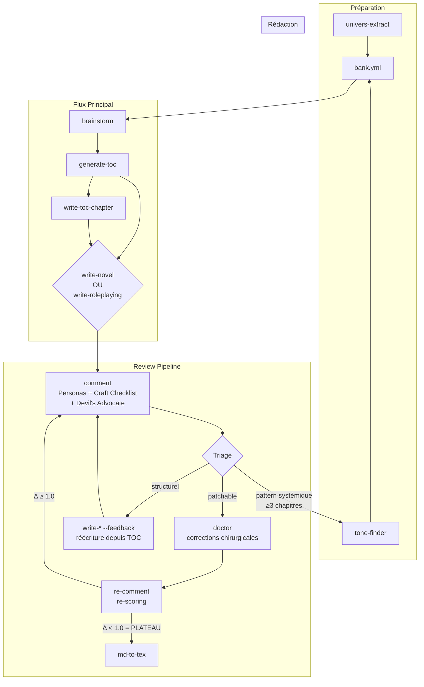
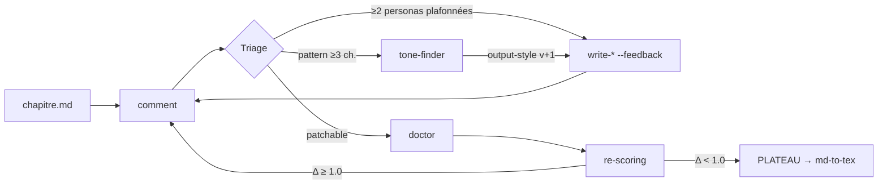

# Workshop: Writing Prompts System

Système de prompts interconnectés pour l'écriture de documents narratifs et JdR.

## Vue d'Ensemble



## Flux de Travail

### Flux Principal

1. **brainstorm** → Élaboration et raffinement du concept
2. **generate-toc** → Création de la table des matières (INDEX.md)
3. **write-toc-chapter** → Fiche détaillée par chapitre (optionnel)
4. **write-novel** OU **write-roleplaying** → Rédaction
5. **comment** → Review personas (Craft Checklist + Devil's Advocate)
6. **Triage** → Issues patchables → **doctor** | Issues structurelles → **write-\* --feedback**
7. **Re-comment** → Boucle (max 3 itérations, arrêt si plateau Δ < 1.0)
8. **tone-finder** → Si pattern systémique détecté (≥3 chapitres), mise à jour output-style
9. **md-to-tex** → Conversion Markdown vers LaTeX

### Review Pipeline (Détail)



**Artefacts** (dans `.wip/`) :
- `comments/chapitre<NN>-personas.md` — Scores et analyse personas
- `changelog/chapitre<NN>-changelog.md` — Corrections appliquées
- `reports/` — Rapports doctor et tone-finder

### Flux Univers (Préparation)

Pour préparer la documentation d'un univers depuis des sources brutes :

```
univers-extract         → Sources brutes → Fichiers thématiques (250 lignes max)
    │
    ├── INDEX.md           (obligatoire)
    ├── terminologie.md    (obligatoire)
    ├── histoire.md        (si contenu détecté)
    ├── geographie.md      (si contenu détecté)
    ├── factions.md        (si contenu détecté)
    ├── personnages.md     (si contenu détecté)
    └── [thème custom].md  (magie, technologie, creatures, religions, economie)
```

**Options :**
- `--update` : Enrichit les fichiers existants avec de nouvelles sources
- `--force` : Régénère tout même si fichiers existent

Stockage : `<univers>/.docs/`

### Flux Extraction (Multi-Session)

Pour importer du contenu depuis un PDF source :

```
extract (Phase A)       → Setup + Split PDF
    ↓
extract (Phase B ×N)    → 1 chunk par session (reprendre via progress.md)
    ↓
extract (Phase C)       → Fusion + Distribution + Cleanup
```

Stockage intermédiaire : `docs/extraction/<source-name>/`

### Flux Style (Préparation)

Pour créer les output-styles d'un univers :

```
tone-finder            → Sources texte → output-styles (novel, rules, scenario)
```

Stockage : `<univers>/.output-styles/`

### Flux Alternatifs

| Point d'Entrée | Cas d'Usage |
|----------------|-------------|
| `univers-extract` | Nouvel univers à documenter depuis sources |
| `tone-finder` | Créer output-styles pour un univers |
| `brainstorm` | Nouveau projet à conceptualiser |
| `generate-toc` | Structure à créer depuis un document source |
| `write-toc-chapter` | Fiche détaillée pour un chapitre spécifique |
| `write-novel` | Chapitre spécifique à rédiger (narratif) |
| `write-roleplaying` | Chapitre spécifique à rédiger (JdR) |
| `review-*` | Texte existant à réviser |
| `doctor` | Analyse qualitative par personas |
| `md-to-tex` | Conversion Markdown vers LaTeX |
| `research` | Sujet à documenter via recherche web |
| `upgrade` | Auto-amélioration itérative d'un texte |
| `tabula-rasa` | Repartir de zéro sur un projet existant |

## Prompts Disponibles

| Prompt | Rôle | Entrée | Sortie |
|--------|------|--------|--------|
| `univers-extract` | Extrait et organise docs univers | Sources brutes | Fichiers thématiques |
| `tone-finder` | Génère output-styles depuis sources | Univers + sources | output-styles/*.md |
| `brainstorm` | Élabore et raffine le concept | Projet | overview.md |
| `generate-toc` | Crée la table des matières | Document source | .toc/INDEX.md |
| `write-toc-chapter` | Fiche détaillée par chapitre | Numéro chapitre | .toc/toc-chapter*.md |
| `write-novel` | Écrit du contenu narratif (--feedback: réécriture informée) | Numéro chapitre [--feedback] | chapitre.tex/md |
| `write-roleplaying` | Écrit du contenu JdR (--feedback: réécriture informée) | Numéro chapitre [--feedback] | chapitre.tex/md |
| `comment` | Review personas (Craft Checklist, Devil's Advocate, scoring) | chapitre.md | .wip/comments/ |
| `doctor` | Corrections chirurgicales (issues patchables du comment) | chapitre.md | .wip/changelog/ |
| `review-pipeline` | Orchestre comment → triage → doctor/rewrite → boucle | chapitre.md | .wip/ |
| `review-chapter` | Vérifie conformité narrative (legacy) | chapitre.tex | Rapport review |
| `review-roleplay` | Vérifie conformité JdR + règles (legacy) | chapitre.tex | Rapport review |
| `md-to-tex` | Convertit Markdown en LaTeX | chapitre.md | chapitre.tex |
| `research` | Recherche croisée web | Sujet | Rapport recherche |
| `generate-persona` | Crée définition persona | Description lecteur | persona.yml |
| `extract` | Extraction PDF (multi-phases) | PDF + univers | Fichiers univers |
| `extract-debug` | Diagnostique les problèmes | progress.md | Rapport debug |
| `upgrade` | Auto-amélioration itérative | Texte | Texte amélioré |
| `tabula-rasa` | Reset projet, extrait essence en overview | Projet | overview.md + reset |

## Ressources Requises

Chaque prompt charge ses ressources depuis `bank.yml` :

| Ressource | Localisation | Utilisée Par |
|-----------|--------------|--------------|
| output-style | `<univers>/.output-styles/` | Tous |
| docs | `<univers>/.docs/` | Tous |
| toc | `toc.md` (projet) | write-*, review-* |
| templates | `<univers>/.templates/` | write-* |
| rules-files | `docs/rules-files/` | write-roleplaying, review-roleplay |
| personas | `docs/templates/personas/` ou `<univers>/.templates/personas/` | doctor, comment |

## Configuration: bank.yml

Chaque projet doit avoir un `bank.yml` à sa racine :

```yaml
document:
  name: "Mon Projet"
  univers: "archipels"
  type: "novel"  # ou "roleplaying"

output-style:
  global: "archipels/.output-styles/latex-archipels.md"

docs:
  # --- Obligatoires ---
  index: "archipels/.docs/INDEX.md"
  terminologie: "archipels/.docs/terminologie.md"

  # --- Thématiques (décommenter selon besoin du projet) ---
  # histoire: "archipels/.docs/histoire.md"
  # geographie: "archipels/.docs/geographie.md"
  factions: "archipels/.docs/factions.md"
  personnages: "archipels/.docs/personnages.md"
  # magie: "archipels/.docs/magie.md"

toc:
  fichier: "toc.md"

templates:
  package: "archipels/.templates/archipels.sty"
```

**Principe :** Ne charger que les fichiers thématiques pertinents pour le projet (250 lignes max chacun).

Voir `docs/templates/bank.yml` pour le template complet.

## Transitions Entre Prompts

### brainstorm → generate-toc

```
Overview validé → generate-toc overview.md
```

### generate-toc → write-toc-chapter

```
INDEX.md créé → write-toc-chapter <N> (optionnel, pour détails)
```

### generate-toc / write-toc-chapter → write-*

```
Type novel → write-novel <N>
Type roleplaying/scenario → write-roleplaying <N>
```

### write-* → comment (review-pipeline)

```
chapitre.md écrit → comment (personas + Craft Checklist + Devil's Advocate)
                     → scoring /20 par persona
                     → consensus pondéré
```

### comment → triage

```
Issues patchables (typos, stats, termes, show-vs-tell) → doctor (corrections chirurgicales)
Issues structurelles (≥2 personas plafonnées par must-haves) → write-* --feedback (réécriture depuis TOC)
Patterns systémiques (même issue sur ≥3 chapitres) → tone-finder (output-style v+1)
```

### doctor → re-comment (boucle)

```
doctor applique corrections → re-scoring personas
  Δ < 1.0 entre itérations → PLATEAU → STOP (prêt pour md-to-tex)
  Δ ≥ 1.0 → nouvelle itération (max 3)
  Persona individuel Δ < 0.3 → retiré du pool (rotation)
```

### write-* (Markdown) → md-to-tex

```
chapitre.md écrit → md-to-tex chapitre.md → chapitre.tex
```

### upgrade (itératif)

```
Texte existant → upgrade → Évaluation 0-20 → Amélioration → Répéter jusqu'à 20/20
```

## Utilisation

### Démarrer un Nouveau Projet

```bash
# 1. Créer bank.yml
cp docs/templates/bank.yml <univers>/<projet>/bank.yml
# Éditer avec les valeurs du projet

# 2. Créer overview.md avec le concept initial
# (ou utiliser brainstorm pour l'élaborer)
@docs/prompts/workshop/brainstorm.prompt.md <univers>/<projet>

# 3. Créer la table des matières
@docs/prompts/workshop/generate-toc.prompt.md overview.md

# 4. (Optionnel) Détailler un chapitre
@docs/prompts/workshop/write-toc-chapter.prompt.md 01

# 5. Rédiger les chapitres
@docs/prompts/workshop/write-novel.prompt.md 1
@docs/prompts/workshop/write-novel.prompt.md 2
# etc.

# 6. (Si Markdown) Convertir en LaTeX
@docs/prompts/workshop/md-to-tex.prompt.md chapitre01.md
```

### Réviser un Chapitre Existant

```bash
# Review technique
@docs/prompts/workshop/review-chapter.prompt.md chapitre03.tex

# Analyse persona
@docs/prompts/workshop/doctor.prompt.md chapitre03.tex

# Amélioration itérative
@docs/prompts/workshop/upgrade.prompt.md
```

### Recherche Documentaire

```bash
# Rechercher un sujet
@docs/prompts/workshop/research.prompt.md "histoire des navigateurs archipels"
```

### Préparer un Nouvel Univers

```bash
# Extraire et organiser depuis des sources brutes
@docs/prompts/workshop/univers-extract.prompt.md otherscape sources/core-book.txt sources/setting.md

# Enrichir avec de nouvelles sources (mode incrémental)
@docs/prompts/workshop/univers-extract.prompt.md otherscape --update sources/supplement.txt

# Régénérer complètement
@docs/prompts/workshop/univers-extract.prompt.md otherscape --force sources/*.txt
```

**Fichiers générés dans `<univers>/.docs/` :**

| Fichier | Contenu | Taille max |
|---------|---------|------------|
| INDEX.md | Vue d'ensemble, méta, instructions | 250 lignes |
| terminologie.md | Vocabulaire canonique | 250 lignes |
| histoire.md | Chronologie, événements | 250 lignes |
| geographie.md | Lieux, régions, distances | 250 lignes |
| factions.md | Organisations, relations | 250 lignes |
| personnages.md | PNJ, motivations, secrets | 250 lignes |
| magie.md | Système magique (optionnel) | 250 lignes |
| technologie.md | Niveau tech (optionnel) | 250 lignes |
| creatures.md | Bestiaire (optionnel) | 250 lignes |
| religions.md | Cultes, croyances (optionnel) | 250 lignes |
| economie.md | Commerce, monnaie (optionnel) | 250 lignes |

### Créer les Output-Styles

```bash
# Générer output-styles depuis sources texte
@docs/prompts/workshop/tone-finder.prompt.md archipels sources/roman.txt sources/regles.md

# Générer uniquement pour un type
@docs/prompts/workshop/tone-finder.prompt.md archipels --only novel sources/roman.txt

# Enrichir styles existants
@docs/prompts/workshop/tone-finder.prompt.md archipels --extend sources/supplement.txt
```

**Fichiers générés dans `<univers>/.output-styles/` :**

| Fichier | Usage |
|---------|-------|
| latex-\<univers\>-novel.md | Style narratif (romans, nouvelles) |
| latex-\<univers\>-rules.md | Style règles (mécaniques JdR) |
| latex-\<univers\>-scenario.md | Style scénario (descriptions, PNJ) |

## Personas (pour doctor.prompt.md)

Hiérarchie de chargement :
1. `<projet>/.templates/personas/` (surcharge projet)
2. `<univers>/.templates/personas/` (défaut univers)
3. `docs/templates/personas/` (défaut global)

| Persona | Pour | Focus |
|---------|------|-------|
| `casual-reader` | Roman | Divertissement, fluidité |
| `lore-enthusiast` | Roman/Guide | Worldbuilding, cohérence |
| `gm-practitioner` | JdR | Utilisabilité, instructions |
| `player-immersive` | JdR | Atmosphère, immersion |
| `editor-critical` | Tous | Qualité, style |
| `speedreader` | Tous | Rythme, efficacité |

Personas spécifiques par univers (exemples) :
- Archipels : `marin-veteran`, `explorateur-curieux`
- WoT : `fan-canonique`, `novice-univers`

## Rapports Générés

| Prompt | Rapport | Localisation |
|--------|---------|--------------|
| brainstorm | Concept projet | `overview.md` |
| generate-toc | Table des matières | `.toc/INDEX.md` |
| write-toc-chapter | Fiche chapitre | `.toc/toc-chapter*.md` |
| research | Rapport recherche | `docs/research/<date>-<sujet>.md` |
| review-* | Rapport review | Console (non sauvegardé) |
| doctor | Rapport persona | Console (non sauvegardé) |
| md-to-tex | Fichier LaTeX | `chapitres/*.tex` |
| tone-finder | Output-styles | `<univers>/.output-styles/*.md` |

## Comparaison avec AIDD

| AIDD (Code) | Workshop (Écriture) |
|-------------|---------------------|
| elaborate | brainstorm |
| plan | generate-toc + write-toc-chapter |
| implement | write-novel / write-roleplaying |
| review_functional | comment (review-pipeline) |
| - | doctor |
| - | review-pipeline (boucle itérative) |
| - | tone-finder |
| - | md-to-tex |
| - | upgrade |
| research | research |

## Version

**Version:** 2.3
**Date:** 2026-02-15
**Changelog:**
- 2.3 : Diagramme et flux principal mis à jour avec la boucle review-pipeline complète (comment → triage → doctor/rewrite → re-comment → plateau). Ajout section "Review Pipeline (Détail)". `comment` distingué de `doctor`. Fichier déplacé de `docs/prompts/workshop/` vers `docs/`.
- 2.2 : write-novel/write-roleplaying v2.0 (mode --feedback: réécriture informée par personas, depuis TOC). review-pipeline v4.0 (triage doctor vs rewrite --feedback)
- 2.1 : Ajout `tabula-rasa` (reset projet avec extraction essence)
- 2.0 : Refonte majeure du flux
  - Ajout `brainstorm` (conception projet)
  - Ajout `generate-toc` (remplace write-toc, génère INDEX.md)
  - Ajout `write-toc-chapter` (fiches chapitres détaillées)
  - Ajout `tone-finder` (génération output-styles)
  - Ajout `md-to-tex` (conversion Markdown → LaTeX)
  - Ajout `upgrade` (amélioration itérative)
  - Ajout `comment` (alias doctor)
  - Consolidation `extract` (absorbe extract-chunk et extract-distribute)
  - Suppression `evaluate` (remplacé par brainstorm)
  - Suppression `write-toc` (remplacé par generate-toc)
- 1.1 : Ajout `univers-extract` pour préparation documentation univers
- 1.0 : Version initiale

**Auteur:** Généré par Claude Code
