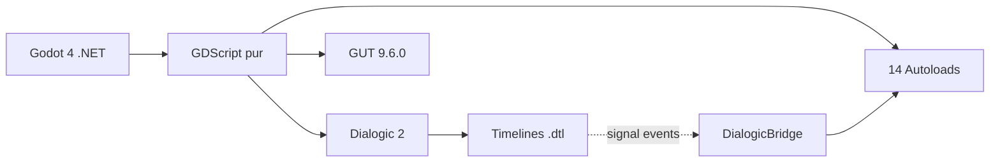
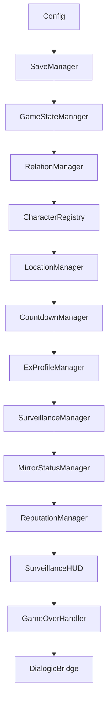
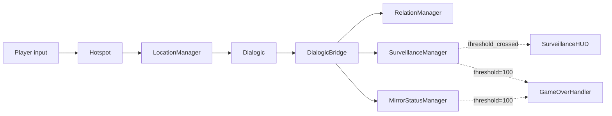

# Architecture

## Language/Framework

- **Moteur** : Godot 4.6 .NET (mais aucun C# — GDScript pur)
- **Langage** : GDScript
- **Plugins actifs** : Dialogic 2 (roman visuel) · GUT 9.6.0 (tests)
- **Plugin retiré** : Maaack's Game Template (parse global Godot causait erreurs)



### Naming Conventions

- **Fichiers** : snake_case (`save_manager.gd`, `s1_01_intro.tscn`)
- **Classes / Autoloads** : PascalCase (`SaveManager`, `RelationManager`)
- **Méthodes publiques** : impératif français snake_case (`modifier()`, `aller_a()`, `sauvegarder()`)
- **Hooks Godot** : conservés en anglais (`_ready`, `_input`, `_process`)
- **Variables / Constantes** : snake_case français
- **Signaux** : snake_case (`threshold_crossed`, `relation_changed`)

## Pattern autoloads

14 autoloads chargés dans un **ordre strict** défini dans `project.godot [autoload]`. Référence canonique : `docs/ARCHITECTURE_8MINE.md`. Détail interne : `aidd_docs/memory/internal/architecture.md`.



**Règle d'or** : pas de référence inter-managers dans `_ready()`. Utiliser le nom global de l'autoload ou un setter d'injection.

## Pattern Signal-driven UI

Les composants UI n'ont jamais de copie locale d'état. Ils s'abonnent aux signaux des managers. `get_node_or_null()` pour dépendances optionnelles (dégradation gracieuse si plugin absent).

## Pattern Save/Load

- Chaque manager implémente `save_state()`, `load_state(data)`, `reset_all_for_new_game()`.
- `SaveManager` : registre **explicite** de 9 managers (pas d'auto-discovery).
- Format JSON v2 dans `user://saves/save_N.json`.
- Migration v1 → v2 gérée au load.

## Pattern DialogicBridge

Les timelines `.dtl` pilotent l'état via événements `Signal` Dialogic :

```
[signal arg="commande:arg1:arg2"]
```

`DialogicBridge` parse et dispatche vers le manager approprié. 10 dispatchers. Détail : `aidd_docs/memory/internal/api-cheatsheet.md`.

## Communication interne


