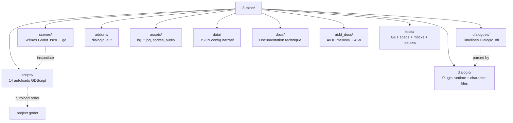

# Codebase Structure

## Dossiers clés

- `scenes/` — racines visuelles (rooms point-and-click, écrans, UI overlays)
- `scripts/` — autoloads, gestionnaires, helpers GDScript
- `dialogues/` — timelines Dialogic `.dtl` (un fichier = une scène/dialogue)
- `addons/dialogic/` — plugin Dialogic 2
- `addons/gut/` — plugin GUT 9.6.0
- `data/` — JSON statiques (PNJ, paliers, factions, configs UI complexes)
- `docs/` — `ARCHITECTURE_8MINE.md`, `API_PUBLIQUE.md`, `MECANIQUES_8MINE.md`, etc.
- `aidd_docs/` — mémoire AI (memory/internal, memory/external, aiw/8mine)
- `tests/` — `helpers/test_environment.gd`, `mocks/`, specs `test_*.gd`

## Points d'entrée

- `project.godot` — config moteur + ordre des 14 autoloads
- `Main.tscn` — scène de démarrage (Maaack supprimé)
- `tests/run_tests.bat` / `tests/run_tests.sh` — runner GUT
