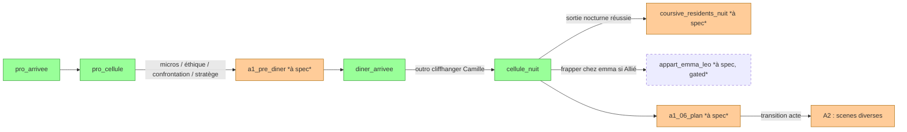

# Index des scènes — 8-MINE

> Catalogue de toutes les scènes jouables, scene-specs ou node-specs confondues.
> Source de référence pour `write-scene`, `graph-audit`, et la production manuelle.

---

## Bilan

| Statut | Compte | Détail |
|---|---|---|
| Scenes-specs livrées | 2 | `diner_arrivee`, `cellule_nuit` |
| Node-specs (scènes scriptées non-réutilisables) | 2 | `01.md` (PRO-01), `02.md` (PRO-02) |
| Scenes à spec (P0) | ≥ 4 | `appart_emma_leo`, `coursive_residents_nuit`, `poste_memorize_partage`, `confrontation_camille` |
| Scenes à spec (P1) | ≥ 5 | `diner_hebdomadaire`, `atelier_leo`, `salon_camille`, `poste_technique_alex_sofia`, codas A4-FIN-* |

---

## Par acte

### CP — Création de personnage
| ID | Format | Statut | Notes |
|----|--------|--------|-------|
| `cp_creation_personnage` | node-spec | à spec | NODE unique, hors temps de jeu |

### PRO — Prologue
| ID | Format | Statut | Notes |
|----|--------|--------|-------|
| `pro_arrivee` *(PRO-01)* | node-spec `nodes/01.md` | ✅ implémenté | scène point-and-click jouée 2025-11-21 |
| `pro_cellule` *(PRO-02)* | node-spec `nodes/02.md` | spec OK, dtl à finaliser | premier choix micros |

### A1 — Acte I
| ID | Format | Statut | Notes |
|----|--------|--------|-------|
| `a1_pre_diner` *(variantes éthique / micros / stratège)* | node-spec | à spec | variantes après PRO-02 |
| `a1_confrontation_emma` | scene-spec ou node-spec | à spec | confrontation appart Emma/Léo *(intersection avec scene `appart_emma_leo`)* |
| **`diner_arrivee`** | scene-spec | ✅ specced | premier dîner, one-shot, 8 PNJ forcés |
| **`cellule_nuit`** | scene-spec | ✅ specced | récurrente A1/A2/A3, hub seuils intimes |
| `coursive_residents_nuit` | scene-spec | à spec | espace de croisement post-dîner, contexte de seuils Emma |
| `a1_06_plan` | node-spec | à spec | choix d'approche fin acte I |

### A2 — Acte II
| ID | Format | Statut | Notes |
|----|--------|--------|-------|
| `appart_emma_leo` | scene-spec | à spec | gated `palier:emma ≥ Allié`, hôte d'événements seuil Emma |
| `appart_marine_thomas` | scene-spec | à spec | gated `palier:marine ≥ Allié` ou `palier:thomas ≥ Allié` |
| `appart_sofia_alex` | scene-spec | à spec | gated `palier:sofia ≥ Allié` + couple intact |
| `atelier_leo` | scene-spec | à spec | semi-privé, gated `palier:leo ≥ Favorable` |
| `poste_memorize_partage` | scene-spec | à spec | accès si Emma allié couvre Margot |
| `poste_technique_alex_sofia` | scene-spec | à spec | semi-privé Nexus |
| `salon_camille` | scene-spec | à spec | gated `palier:camille ≥ Favorable` |

### A3 — Acte III
| ID | Format | Statut | Notes |
|----|--------|--------|-------|
| `confrontation_camille` | scene-spec | à spec | scène majeure A3 |
| `verdict_frank` | scene-spec ou node-spec | à spec | one-shot ou récurrente selon design |
| `emma_sous_pression` | node-spec | à spec | `flag_emma_exposee = true` OU `EV ≥ 4` |

### A4 — Acte IV
| ID | Format | Statut | Notes |
|----|--------|--------|-------|
| `a4_choix_editorial` | node-spec | à spec | NODE-charnière A4 |
| `coda_fin_a` à `coda_fin_i` | node-spec × 9 | à spec | 1-2 NODEs par fin (conséquence immédiate + plan moral) |

---

## Par lieu

### Espaces publics *(pas de gating relation)*
- `zone_commune_soir` → `diner_arrivee` *(et `diner_hebdomadaire` futur)*
- `zone_commune_jour` → contexte de transitions
- `coursive_residents_nuit` → scene à spec
- `cellule_margot_nuit` → `cellule_nuit`
- `cellule_margot_jour` → `pro_cellule` *(node-spec)*
- `hall_tour`, `ascenseur`, `couloir_residences` → `pro_arrivee` *(node-spec)*

### Espaces semi-privés *(gating `palier:<occupant> ≥ Favorable`)*
- `atelier_leo` → à spec
- `poste_technique_alex_sofia` → à spec
- `salon_camille` → à spec
- `poste_memorize_partage` → à spec

### Espaces privés *(gating `palier:<occupant> ≥ Allié` ou plus)*
- `appart_emma_leo` → à spec (Allié)
- `appart_marine_thomas` → à spec (Allié)
- `appart_sofia_alex` → à spec (Allié + couple intact)
- `appart_camille_frank` → à spec (Confident)

### Lieux externes *(hors immeuble Saint-Michel)*
- `bureau_witness` → à spec si arc Witness se concrétise
- *(non prioritaire pour le moment)*

---

## Catalogue des événements de seuil cités par les scenes existantes

Suivre `pnjs-behavior/<pnj>.md` pour la définition canonique :

| Event ID | Source pnj-behavior | Cité par scenes |
|----------|---------------------|-----------------|
| `event_emma_favorable` | `emma.md` ✅ | *(non explicitement, présent en buffer)* |
| `event_emma_allie` | `emma.md` ✅ | `cellule_nuit` |
| `event_emma_confident` | `emma.md` ✅ | `cellule_nuit` |
| `event_emma_julien_intervention` | `emma.md` ✅ | *(scenes A3/A4 à spec)* |
| `event_alex_favorable` | `alex.md` ✅ | *(scenes A2 à spec — poste_technique_alex_sofia)* |
| `event_alex_allie` | `alex.md` ✅ | *(poste_technique_alex_sofia à spec)* |
| `event_alex_revelation_taupe` | `alex.md` ✅ | *(scenes A2 — 3 canaux Emma/Léo/Sofia)* |
| `event_alex_confident` | `alex.md` ✅ | *(poste_technique_alex_sofia à spec)* |
| `event_alex_franchi_optin` | `alex.md` ✅ | *(scénique opt-in joueur, verrouillé EV≥4 + flag_double_agent)* |
| `event_frank_test_integrite` | `frank.md` ✅ | *(récurrent, cap 3, déclenchable dans scenes A1-A3)* |
| `event_frank_favorable` | `frank.md` ✅ | *(zone_commune_jour à spec)* |
| `event_frank_rencontre_nocturne` | `frank.md` ✅ | `cellule_nuit` |
| `event_frank_verdict_a3` | `frank.md` ✅ | *(verdict_frank A3 à spec — automatique countdown ≤ 7)* |
| `event_frank_confident` | `frank.md` ✅ | *(scenes A4 — coda FIN-E Frank)* |
| `event_sofia_alignement_test` | `sofia.md` ✅ | *(scénique, déclenchable scenes A1-A2 dès Méfiance + initiative Sofia)* |
| `event_sofia_allie` | `sofia.md` ✅ | *(poste_technique_alex_sofia à spec, post `flag_sofia_alliee`)* |
| `event_sofia_proche` | `sofia.md` ✅ | *(scenes intimes uniquement — appart_sofia_alex, cellule_nuit rare)* |
| `event_sofia_confident` | `sofia.md` ✅ | *(scenes A4 — coda FIN-E Sofia « L'Acte éthique »)* |
| `event_sofia_blessee_intime` | `sofia.md` ✅ | *(automatique post `event_alex_franchi_optin` — scene matin obligatoire)* |
| `event_sofia_alliance_frank_visible` | `sofia.md` ✅ | *(récurrent ambiance — zone_commune_jour, verdict_frank avec Sofia/Frank co-présents)* |
| `event_camille_cliffhanger` | `camille.md` ✅ | `diner_arrivee` |
| `event_camille_favorable` | `camille.md` ✅ | *(scenes A2 à spec)* |
| `event_camille_allie` | `camille.md` ✅ | *(scenes A2 à spec — salon_camille, croisements)* |
| `event_camille_demasquee_test` | `camille.md` ✅ | *(scene `confrontation_camille` A3 à spec)* |
| `event_camille_dark_proposition` | `camille.md` ✅ | *(scene `salon_camille` à spec)* |
| `event_camille_obsession` | `camille.md` ✅ | *(scenes A3+ à spec)* |
| `event_seuil_surveillance_75` | code natif `SurveillanceManager` | `cellule_nuit` |

---

## Mermaid — flux principal (Acte I)

---

## Conventions

- **Scene-spec** = scène récurrente OU multi-PNJ avec sujets variables. Format : `aidd_docs/aiw/8mine/templates/scene-spec.md`.
- **Node-spec** = scène scriptée linéaire et unique (prologue, codas FIN, NODEs charnière). Format : `aidd_docs/aiw/8mine/templates/node-spec.md`.
- **Gating** : déclaré dans le YAML `acces_requis:` de chaque scene-spec. Cf. overview `§ Gating d'accès aux espaces privés`.
- **Variables PNJ** : présence résolue au runtime selon règles déclarées dans `Variables PNJ` de chaque scene-spec. Cf. overview `§ Architecture narrative`.
- **Événements de seuil** : déclarés dans `pnjs-behavior/<pnj>.md`, *injectés* dans les scenes via leur table dédiée.

---

*Index maintenu à la main pour le moment. À automatiser via `node-manage --list` *(à refondre en `scene-manage`)*.*
