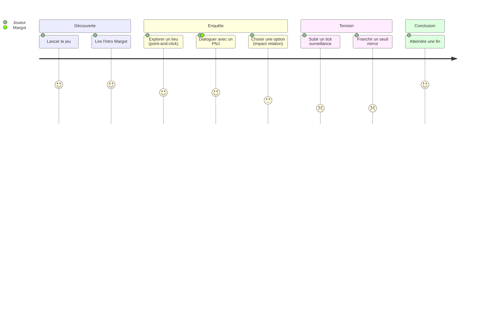

# PROJECT_BRIEF.md

## Executive Summary

- **Nom** : 8-MINE
- **Vision** : Faire vivre une enquête journalistique sous pression dystopique où chaque relation pèse autant que chaque preuve.
- **Mission** : Thriller cyberpunk narratif jouable au croisement du roman visuel (Dialogic 2) et du point-and-click, autour de Margot — journaliste enquêtant sur Stratom Corp.

### Description

Jeu solo, narratif, deux modes de jeu intégrés :
- **Roman visuel** : dialogues Dialogic 2 avec choix à conséquences pondérés par 17 PNJ et 8 factions.
- **Point-and-click** : exploration de lieux (hotspots, PNJ navigables, caméras de surveillance).

Tensions centrales : pression `Surveillance` externe `[0-100]` × dette psychologique `Mirror` `[0-100]` × 17 relations affectives `[-100, +100]`. Décisions irréversibles, seuils à franchissement unique, multiples fins.

## Context

### Core Domain

Narratif interactif cyberpunk. Inspirations : *Disco Elysium* (gravité psychologique), *80 Days* (économie des choix), *Citizen Sleeper* (pression de système).

### Ubiquitous Language

| Terme | Définition | Synonymes |
|-------|------------|-----------|
| Margot | Protagoniste journaliste, joueur·euse | PJ, protagoniste |
| Mirror | Dette d'authenticité psychologique [0-100] | dette miroir, dette psy |
| Surveillance | Pression externe corpos/sécurité [0-100] | menace externe, pression |
| Palier | Seuil de relation PNJ (9 paliers de -100 à +100) | stage relationnel |
| Faction | Groupe affilié avec standing [-100,+100] (stratom, marine, presse, police, activistes, memorize, nexus, kaizen) | corpo, groupe |
| Hotspot | Zone interactive dans un lieu point-and-click | zone, cible cliquable |
| Timeline | Fichier `.dtl` Dialogic = un dialogue/scène | dtl, scène |
| Autoload | Singleton GDScript chargé au démarrage | manager, singleton |
| Sous-Paris | Quartier underground du jeu | Deep-Paris (déprécié) |

## Features & Use-cases

- **Enquête narrative** : recueillir preuves, interroger PNJ, recouper sources.
- **Système relationnel** : 17 PNJ avec 9 paliers affectifs et timelines de dialogue conditionnelles.
- **Surveillance dynamique** : pression externe augmente avec les actions risquées, déclenche cinematics et game over.
- **Mirror psychologique** : trahisons et manipulations creusent la dette, verrouillent des options dialogue.
- **Game over multiples** : surveillance ≥ 100, mirror ≥ 100, ou fins narratives spécifiques.
- **Save/Load 3 slots** : JSON v2 dans `user://saves/`.

## User Journey

### Persona — Joueur·euse type

Adulte amateur·trice de jeux narratifs gravity (*Disco Elysium*, *Pentiment*). Lit chaque ligne, accepte la lenteur, attend des conséquences durables. Détecte la fausse profondeur.
